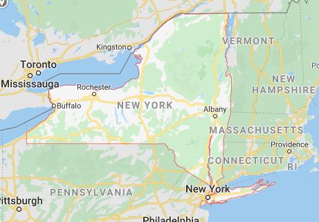

# NYCTaxiProject

For this project, we were tasked with 10 inquiries into the data file given. The data file I chose to use was the 4th section of the NYCTaxi data, trip_data_4.csv. 

## Question 1: Time Range + Number of Rows 

The number of rows of the data is pretty straight forward to pin down. Namely, in our main loop, we iterate each row of the data and then keep a counter, 'n', which counts every iteration of our loop. The structure of the code for this part looks like this:  

```python
n = 0 

for row in reader:
        n+=1 
```

and we then simply print out the value of n at the end to find the total number of rows of the dataset:

```python 
print("Number of rows in data:", n) 
``` 

and the result was the following: 
> **Number of rows in data: 15100469**


for the time range of the data, we take a look at the two time related fields: 

* pickup_datetime
* dropoff_datetime 

Logically, to find a accurate time range of the data, given the common sense domain understanding of a taxi fair, the earliest time stamp would be the earliest *pick-up* time, and the latest time stamp would be latest *drop-off* time. 

To accomplish the coding for the min pick-up and max drop-off values, we first intialize the min pick-up and max drop-off variables as the first variables seen for the fields in row 1:

```python
if n == 1:    
        min_pickupdts = row[5]
        max_dropoffdts = row[6]
```

Now that we have the variables set, we set up the code that will compare each new pick-up and drop-off value to the already set max/min variables, as follows: 

```
if n > 0: 
        if row[5] < min_pickupdts:
            min_pickupdts = row[5] 
        if row[6] > max_dropoffdts:
            max_dropoffdts = row[6]
```

Running this code, we get the following time range for the data: 

```python
print("Dates range from %s to %s" % (min_pickupdts, max_dropoffdts))
``` 
> **Dates range from 2013-04-01 00:00:00 to 2013-05-01 02:19:25**


## Question 2: Field Names + Descriptions

Next, we want to know the name of the fields, or the columns, of the dataset. We simple use this code within the main loop, specifically at row 0, the header row, to find out the name of the fields: 

```python
if n == 0:
        col_names = row

```

and then print the results: 

```python
print("Name of fields: ", col_names)
```
> **Name of fields:  ['medallion', ' hack_license', ' vendor_id', ' rate_code', ' store_and_fwd_flag', ' pickup_datetime', ' dropoff_datetime', ' passenger_count', ' trip_time_in_secs', ' trip_distance', ' pickup_longitude', ' pickup_latitude', ' dropoff_longitude', ' dropoff_latitude']**

Some fields are self-explanatory in their meanings, and others less so. Some of the field descriptions that may not be self-explanatory from their names alone were able to be figured out by looking over the sample data from the datafile (*See Question 3*)

1. *medallion*: a 32 character ID of sorts consisting of letter and numbers 
2. *hack_license*: a 32 character ID of sorts consisting of letter and numbers 
3. *vendor_id*: potentially the vendor ID of the taxi company 
4. *rate_code*: potentially code of rate of charge of the taxi fair 
5. *store_and_fwd_flag*: a boolean flag consisting of 'N' or 'Y' values
6. *pickup_datetime*: datetime of pickup 
7. *dropoff_datetime*: datetime of dropoff
8. *passenger_count*: number of passengers in the taxi during the trip
9. *trip_time_in_secs*: time in seconds of trip 
10. *trip_distance*: distance of trip (units is unknown; likely is miles or km from the looks of the sample data)
11. *pickup_longitude*: longitude decimal value of pickup location 
12. *pickup_latitude*: latitude decimal value of pickup location
13. *dropoff_longitude*: longitude decimal value of dropoff location
14. *dropoff_latitude*: latitude deciaml value of dropoff location 

## Question 3: Sample Data 

To get a feel for the data, we can take a look at a small sample of the data. For this case, I decided 5 rows of data would be succifient for the purpose of getting an idea of what the data looked like. To do this, since the memory usage would be very minimal with a 5 row, 14 column array, I assigned a dataframe from the pandas library to store the sample data. 

First, for the header row, I assigned the name of the columns to the dataframe: 

```python 
if n == 0: 
        df = pd.DataFrame(columns = col_names)
```

Next, the code to add the first 5 rows of the dataset into the dataframe: 

```python 

if n < 6:
    df.loc[len(df)] = row

```

And lastly, to print the sample data to the console:
(*note: n==10 as a condition was chosen at random, the only requirement for this number is that it is greater than 5*)

```python
if n == 10:
        for col in col_names:
            print(df[col])
```


And viola! We get to peep into what the large dataset looks like at a very small scale: 
(*note: alternatively, the sample data could have been collected in a dictionary of lists as well. That method may have been more memory-efficient, potentially. However, due to the small sample number that was collected, the difference between the two methods would be very small)

> * 0    91F6EB84975BBC867E32CB113C7C2CD5
> * 1    EC34CD1B3797DFAFF3FE099BA87B6656
> * 2    C1B9DA774DC2BBC6DE27CE994E7F44A0
> * 3    9BA84250355AB3FC031C9252D395BF8A
> * 4    205A696DF62AD03C88DA8C5EC5248639
> * Name: medallion, dtype: object
> * 0    AD8751110E6292079EB10EB9481FE1A6
> * 1    8FE6A4AEDF89B6B4E19D2377FD3FB7D7
> * 2    E1B595FD55E4C82C1E213EB17438107A
> * 3    16BB0D96A0DCC853AEC7F55C8D6C71E0
> * 4    579C41EA5EC846F8B641A42F9EE3E855
> * Name:  hack_license, dtype: object
> * 0    CMT
> * 1    CMT
> * 2    CMT
> * 3    CMT
> * 4    CMT
> * Name:  vendor_id, dtype: object
> * 0    1
> * 1    1
> * 2    1
> * 3    1
> * 4    1
> * Name:  rate_code, dtype: object
> * 0    N
> * 1    N
> * 2    N
> * 3    N
> * 4    N
> * Name:  store_and_fwd_flag, dtype: object
> * 0    2013-04-04 18:47:45
> * 1    2013-04-05 07:08:34
> * 2    2013-04-04 17:59:50
> * 3    2013-04-04 18:12:01
> * 4    2013-04-04 20:12:57
> * Name:  pickup_datetime, dtype: object
> * 0    2013-04-04 19:00:25
> * 1    2013-04-05 07:17:34
> * 2    2013-04-04 18:21:48
> * 3    2013-04-04 18:25:24
> * 4    2013-04-04 20:29:55> 
> * Name:  dropoff_datetime, dtype: object
> * 0    1
> * 1    1
> * 2    1
> * 3    1
> * 4    1
> * Name:  passenger_count, dtype: object
> * 0     759
> * 1     540
> * 2    1318
> * 3     799
> * 4    1017
> * Name:  trip_time_in_secs, dtype: object
> * 0    2.50
> * 1    1.60
> * 2    3.60
> * 3    1.90
> * 4    3.60
> * Name:  trip_distance, dtype: object
> * 0    -73.957855
> * 1             0
> * 2     -73.98288
> * 3    -73.978119
> * 4    -74.006371
> * Name:  pickup_longitude, dtype: object
> * 0     40.76532
> * 1            0
> * 2     40.75499
> * 3    40.763451
> * 4    40.744755
> * Name:  pickup_latitude, dtype: object
> * 0    -73.976273
> * 1             0
> * 2    -74.009186
> * 3    -73.955666
> * 4    -73.961662
> * Name:  dropoff_longitude, dtype: object
> * 0    40.785648
> * 1            0
> * 2    40.715374
> * 3    40.776642
> * 4    40.761082
> * Name:  dropoff_latitude, dtype: object


## Question 4: SQL Data types for fields 

Looking over the sample data from *Question 3* above, as well as looking at the distinct values of each field (*Question 6*) and max/min values (*Question 7*), the SQL data type needed for each field becomes more apparent. Namely, the following data types would best fit for each data field:  

1. *medallion*: varchar(32)
2. *hack_license*: varchar(32)
3. *vendor_id*: varchar(3) 
4. *rate_code*: int
5. *store_and_fwd_flag*: varchar(1)
6. *pickup_datetime*: datetime
7. *dropoff_datetime*: datetime
8. *passenger_count*: int
9. *trip_time_in_secs*: int 
10. *trip_distance*: decimal(3,1)
11. *pickup_longitude*: decimal(2,6)
12. *pickup_latitude*: decimal(2,6)
13. *dropoff_longitude*: decimal(2,6)
14. *dropoff_latitude*: decimal(2,6)


## Question 5: Geographic Range of Data 

To get an idea of the geographic range of the data, we look to the geo-location fields, namely

*pickup_longitude
*pickup_latitude 
*dropoff_longitude 
*dropoff_latitude 

Processing these fields to see the range of values produced interesting results. The results were categorized in four different ways: 

1. value out of range with logical latitude/longitude range 
2. value out of New York state range 
3. value empty or " " 
4. value *legitimate*

Any value not in category 4, categorized as a *legitimate* value for the dataset, was unaccounted for in the geographical location range analysis. 

For the code, first we want to intialize the range of acceptable values: 

```python
long_upper_range = 180 
long_lower_range = -180 

lat_upper_range = 90
lat_lower_range = -90

NY_long_range = [-80, -70]
NY_lat_range = [40,45]
```

Next, we intialize the max/min values for longitude/latitude as the first encountered values in the first row of data within the main loop: 

```python
if n == 1: 
        max_geo_longitude = float(row[10])
        min_geo_longitude = float(row[10])
        max_geo_latitude = float(row[11])
        min_geo_latitude = float(row[11])
```

Next, for each four geolocation variables in each row of data, we set-up a rather identical code chunk to process the comparing and replacing of max/min values for that variable. To reduce redundancy, I will show the code used for the one of variables above, namely *pickup longitude*, which will be identical for the remaining 3 variables, other than using the different associated variables: 

```python 
pickuplong = row[10]

if pickuplong == "":
    geo_empty_count += 1 
            
if pickuplong != "":            
    if (float(pickuplong) > float(long_upper_range)) or (float(pickuplong) < float(long_lower_range)): 
        long_flag_list.append(pickuplong)
    elif (float(pickuplong) > float(NY_long_range[1])) or (float(pickuplong) < float(NY_long_range[0])):
        long_flag2_list.append(pickuplong)
    else:  
        if float(pickuplong) > max_geo_longitude:
            max_geo_longitude = float(pickuplong)
        if float(pickuplong) < min_geo_longitude:
            min_geo_longitude = float(pickuplong) 
            
```
To further explain the above code, the code chunk above does several things: 
1. test if *pickuplong* is less than minimum longitude value or more than maximum longitude value, and replaces that value accordingly if need be
2. flag and add to a list of flags for 1) geo-location values outside of logical range and 2) geo-location values out of NYC state range 
3. flag and add to count if an empty string is encountered 

The same code chunk above is done for the reminaing three varibles in the same manner, namely:
1. pickuplat
2. dropofflong
3. dropofflat 


Once the main loop is run, we can now print the values and see the geolocation range, as well as looking at how many flags and invalid values we encountered: 
```python
print("FINAL longitude range: [%s:%s]" % (min_geo_longitude,max_geo_longitude))
print("FINAL latitude range: [%s:%s]" % (min_geo_latitude,max_geo_latitude))
print("\n") 
print("long range flag:", len(long_flag_list), "- percentage of data: %s%%" % ((len(long_flag_list)/n)*100))
print("lat range flag:", len(lat_flag_list), "- percentage of data: %s%%" % ((len(lat_flag_list)/n)*100))
print("geo empty string flag:", geo_empty_count, "- percentage of data: %s%%" % ((geo_empty_count/n)*100))
print("NY lat range flag:", len(lat_flag2_list), "- percentage of data: %s%%" % ((len(lat_flag2_list)/n)*100))
print("NY long range flag:", len(long_flag2_list), "- percentage of data: %s%%" % ((len(long_flag2_list)/n)*100))
```

Which give us the following output: 
> FINAL longitude range: [-80.0:-70.050003]

> FINAL latitude range: [40.0:44.985409]

> long range flag: 70 - percentage of data: 0.00046356176089630064%

> lat range flag: 111 - percentage of data: 0.0007350765065641338%

> geo empty string flag: 292 - percentage of data: 0.0019337147740245684%

> NY lat range flag: 1786 - percentage of data: 0.011827447213725613%

> NY long range flag: 1689 - percentage of data: 0.01118508305934074%


Now we got an idea of the range of the data, namely the longitude and latitude range above. We also get a sense of how much of data was invalid. For example, around 2% of the data was out-of-range with respect to New York state boundaries.

*note: Though the longitude and latitude range of the data above is collected accurately, because geolocation is based on the **combination** of latitude **and** longitude points, despite the range being accurate and within New York state boundaries, it is possible still that some points counted can be technically out-of-range.*

A rough image of the geolocation range as detailed above, but as depicated on a map: 


